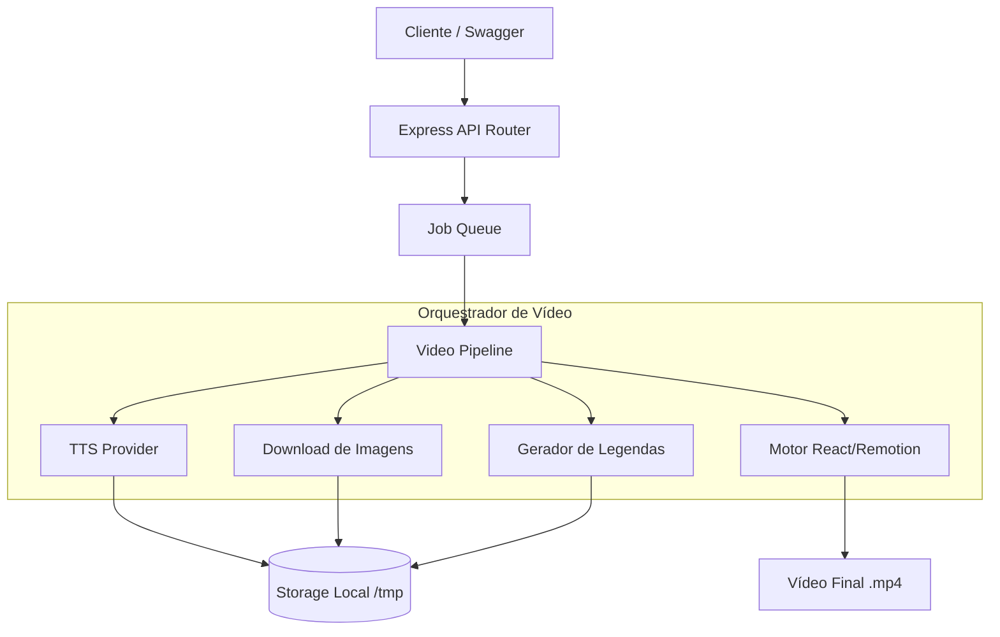

# Video Generator API - Documentação Abrangente

Esta documentação fornece uma visão detalhada da arquitetura, serviços, fluxos de trabalho e orquestração do gerador de vídeos baseado em TypeScript e Remotion.

---

## 1. Visão Geral da Arquitetura (High-Level)

A API do Video Generator é projetada para rodar localmente ou em conteinerização, ouvindo solicitações (`POST`, via fila de Jobs) contendo um "Script" de vídeo, para transformá-lo em um vídeo MP4 publicável.

**Stack Tecnológica:**
* **Linguagem:** TypeScript / Node.js
* **Backend Framework:** Express
* **Renderização de Vídeo:** Remotion (React-based Headless Chromium)
* **Persistência / Banco de Dados:** SQLite (usando driver `better-sqlite3`)
* **Job Queueing:** Sistema de fila local agendada para não sobrecarregar I/O
* **TTS:** OpenAI, ElevenLabs, Google Cloud TTS, Kokoro (local)



---

## 2. Estrutura de Diretórios (`src/`)

* `api/`
  * Servidor HTTP `server.ts` e rotas Express (`routes.ts`). Swagger em `/docs`.
* `config.ts`
  * Variáveis de ambiente `.env`. Chaves de TTS, configurações do Remotion e caminhos temporários.
* `db/`
  * SQLite via `better-sqlite3` em modo WAL. Metadados de jobs em processamento e concluídos.
* `mcp/`
  * Servidor MCP (Model Context Protocol) para integração com agentes AI via SSE.
* `orchestrator/`
  * `video-pipeline.ts`: encadeia TTS → Legendas → Download de imagens → Renderização.
  * `job-queue.ts`: processamento em segundo plano sem travar a requisição.
* `remotion/`
  * Composições React: `<VideoComposition />`, overlays de legendas, efeitos de fórmulas, placeholders de `<Audio>`. Envelopado pelo `Root.tsx`.
* `services/`
  * **music/:** Trilha de fundo randomizada conforme o `mood`.
  * **renderer/:** FFmpeg + Remotion bundler.
  * **storage/:** Pastas temporárias para Chromium + storage final (local FS ou GCS).
  * **subtitle/:** Parsing de `.srt` e geração de captions por palavra/página.
  * **tts/:** Factory multi-provider (OpenAI, ElevenLabs, Google, Kokoro).
* `types/`
  * Schemas Zod + tipos TypeScript para DTOs, cenas e configuração.

---

## 3. Fluxo de Vida do Job (Video Pipeline)

Dentro de `src/orchestrator/video-pipeline.ts`, o pipeline segue 4 fases:

1. **Step 1: TTS Generation**
   Envia o script para o provider TTS selecionado, gerando áudio contínuo. Retorna arquivo MP3 + timestamps por palavra.

2. **Step 2: Subtitle Generation**
   Gera captions por palavra/página a partir dos timestamps do TTS. Formata em blocos visuais para overlay na renderização.

3. **Step 3: Image Download**
   Baixa as imagens fornecidas via `imageUrl` em cada `videoItem`. O download suporta redirects HTTP (301/302/307/308) e envia User-Agent para evitar bloqueios 403. Calcula a duração proporcional de cada cena em relação ao áudio.

4. **Step 4: Remotion Rendering**
   Consolida cenas, áudio (voiceover) e URLs locais via rotas estáticas Express (`/tmp`). Renderiza em MP4 via Remotion + FFmpeg + Chromium Headless.

---

## 4. Segurança e Considerações Críticas

* O `helmet` na API foi configurado sem `crossOriginOpenerPolicy` e `crossOriginResourcePolicy` para permitir que o Chromium Headless (porta 3001) leia os recursos do Express (porta 3000).
* OOM remediado com `--transpile-only` para evitar checagens pesadas do TypeScript em runtime.
* Gestão de Segredos: tokens apenas via `process.env`.

---

## 5. Estrutura do Banco de Dados (SQLite)

`better-sqlite3` em modo WAL.

### Tabela: `jobs`

| Coluna | Tipo | Descrição |
|---|---|---|
| `id` | `TEXT (PK)` | Identificador único (`cuid`) |
| `status` | `TEXT` | `'queued'`, `'processing'`, `'ready'`, `'failed'` |
| `progress` | `INTEGER` | Progresso 0–100 |
| `stage` | `TEXT` | Passo atual (`'tts_generation'`, `'subtitle_generation'`, `'media_search'`, `'rendering'`, `'storage'`) |
| `input_data` | `TEXT` | JSON da requisição original |
| `output_path` | `TEXT` | Caminho do vídeo `.mp4` gerado |
| `error` | `TEXT` | Stack trace em caso de falha |
| `created_at` | `TEXT` | Timestamp de criação |
| `updated_at` | `TEXT` | Timestamp de atualização |

Índices em `status` e `created_at`.

---

## 6. Guia de Instalação

### Passo 1: Dependências Nativas
* **Node.js** >= `18.x` (recomendado `22.x`)
* **Gerenciador de Pacotes**: `yarn`
* **Python/C++ Build Tools**: necessários para `better-sqlite3` (`node-gyp`)

### Passo 2: Clonagem e Instalação
```bash
git clone <url-do-repositorio> video-generator-api
cd video-generator-api
yarn install
```

### Passo 3: Variáveis de Ambiente
```bash
cp .env.example .env
```
Preencher:
* `API_KEY`: autenticação da API
* `ELEVENLABS_API_KEY`: TTS ElevenLabs (opcional se usar outro provider)
* `OPENAI_API_KEY`: TTS OpenAI + Whisper timestamps (opcional)
* `GOOGLE_TTS_KEY_FILE`: Service account Google TTS (opcional)

### Passo 4: Rodar em Desenvolvimento
```bash
yarn dev
```
Porta 3000 (API) + 3001 (Remotion bundler). Banco SQLite criado automaticamente.

### Passo 5: Teste da API
Swagger em `http://localhost:3000/docs`.

1. `POST /api/videos` com roteiro + `videoItems` (cada cena com `imageUrl`)
2. Anotar o `videoId` retornado
3. Polling em `GET /api/videos/{id}/status` até `status: "ready"`
4. Download em `GET /api/videos/{id}`
