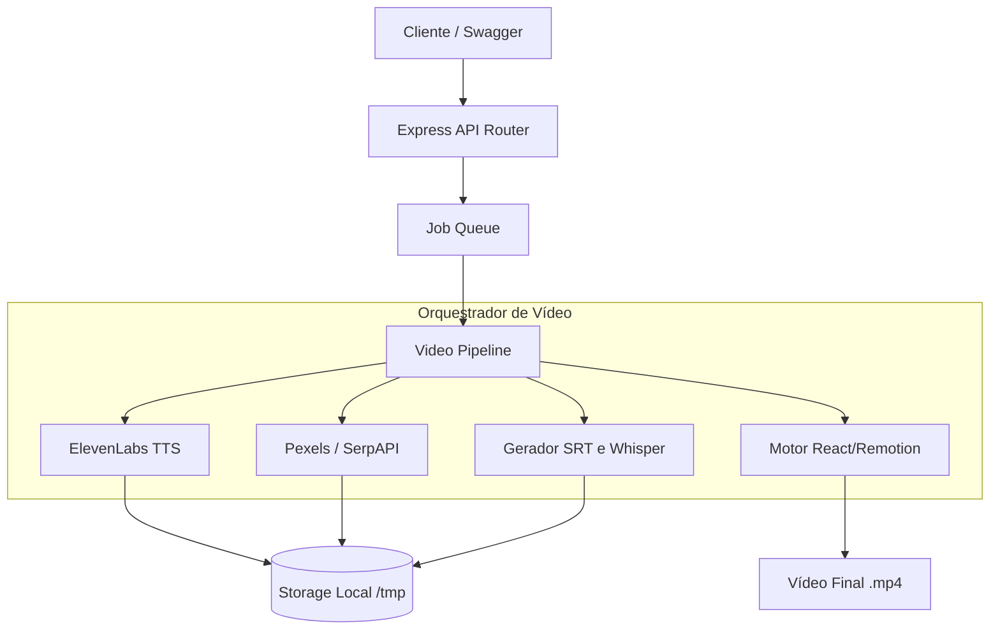

# Video Generator API - Documentação Abrangente

Esta documentação foi gerada para fornecer uma visão detalhada da arquitetura corporativa, serviços, fluxos de trabalho e orquestração do gerador de vídeos autônomo baseado em TypeScript e Remotion.

---

## 1. Visão Geral da Arquitetura (High-Level)

A API do Video Generator é projetada para rodar localmente ou em conteinerização, ouvindo solicitações (`POST`, via fila de Jobs) contendo um "Script" de vídeo, para transformá-lo de forma inteligente e autônoma em um vídeo MP4 publicável.

**Stack Tecnológica:**
* **Linguagem:** TypeScript / Node.js
* **Backend Framework:** Express
* **Renderização de Vídeo:** Remotion (React-based Headless Chromium)
* **Persistência / Banco de Dados:** SQLite (usando driver `better-sqlite3`)
* **Job Queueing:** Sistema de fila local agendada para não sobrecarregar I/O
* **Provedores Externos / Serviços IA:** SerpAPI (imagens), Pexels (vídeo), ElevenLabs (Voz/TTS).



---

## 2. Estrutura de Diretórios (`src/`)

A organização do código-fonte segue Padrões de Design Limpo, desacoplando orquestração, regras de negócio API e módulos de provedores externos.

* `api/`
  * Contém o servidor HTTP `server.ts` e as rotas definidas em Express (`routes.ts`). Utiliza Swagger para documentar localmente `/docs`.
* `config.ts`
  * Ponto focal de injetores do ambiente `.env`. Lida com chaves da ElevenLabs, SerpAPI, configurações do Remotion e caminhos do sistema operacional temporário.
* `db/`
  * Repositórios de SQLite utilizando `better-sqlite3`. Armazena metadados de jobs em processamento e concluídos utilizando raw SQL statements em modo WAL.
* `orchestrator/`
  * Contém `video-pipeline.ts`, o maestro responsável por encadear as chamadas dos microsserviços na ordem exata (Texto -> Áudio -> Busca de Mídia -> Timestamps -> Renderização).
  * Inclui `job-queue.ts` para agendar os processamentos em segundo plano sem travar a requisição do usuário.
* `remotion/`
  * O ecossistema puramente visual de React. Nele estão as `compositions/` como `<VideoComposition />`, os overlays de legendas (`<Subtitles />`), os efeitos de fórmulas matemáticas, e os placeholders de `<Audio>`. Tudo envelopado pelo `Root.tsx`.
* `services/`
  * Módulos agnósticos contendo drivers de comunicação externa (Pexels Provider, SerpAPI Provider).
  * **music/:** Serviço de busca/atribuição de trilha de fundo estilo "bensound" randomizado conforme o `mood`.
  * **renderer/:** Lança e envelopa as bibliotecas internas do `@remotion/bundler`.
  * **storage/:** Gerencia pastas temporárias que o Chromium precisa ler via `file://` ou `http://localhost:3000/tmp`.
  * **subtitle/:** Manipuladores de parsing de `.srt` e conversores de tempo para formatar o áudio da ElevenLabs em timestamps precisos por cena.
* `types/`
  * Declaração de objetos, DTOs e entidades como `VideoJob`, `SceneMedia`, `RemotionRenderInput` e restrições tipadas para TypeScript estrito.

---

## 3. Fluxo de Vida do Job (Video Pipeline)

A etapa mais complexa do sistema acontece dentro de `src/orchestrator/video-pipeline.ts`. Quando o Worker pega a tarefa, o pipeline segue 4 fases rigorosas:

1. **Step 1: TTS Generation**
   Envia o script total em formato texto para o *Text-To-Speech* gerar um arquivo global contínuo (resolvendo o glitch onde vozes cortavam entre cenas). Pega a duração devolvida pelo serviço.

2. **Step 2: Subtitle Generation**
   Analisa o arquivo ou retorno do processamento de áudio para definir a minutagem e os cortes de texto (geração SRT) para sobrepor visualmente em formato Karaokê ou de faixas na base da tela.

3. **Step 3: Media Search**
   Passa pela lista de cenas (`videoItems[]`) providenciadas na request principal. Faz *ping* no provedor correto conforme o `enum`:
   * Se for `"video"`, puxa clipes premium do Pexels via `PexelsProvider`.
   * Se for `"image"`, aciona SerpAPI para preencher tela estática de apoio à voz.
   * Divide a duração total do VoiceOver pelo número de cenas, definindo matematicamente o tempo de tela cravado para cada cena.

4. **Step 4: Remotion Rendering**
   Construção silenciosa (Headless). A API consolida as `scenes`, a origem global de áudio (`voiceover`) e as URLs locais via rotas estáticas criadas no Express (`/tmp`, contornando Helmet). Então joga as propriedades React customizadas (`defaultProps` override) para a suíte Remotion empacotar em um vídeo .mp4 sem perdas através de sua pipeline usando FFmpeg e ChromePuppeteer localmente.

---

## 4. Segurança e Considerações Críticas

* O `helmet` na API local foi propositalmente despido de suas configurações `crossOriginOpenerPolicy` e `crossOriginResourcePolicy` para permitir que o Worker isolado do Chromium Headless (que roda num micro-servidor 3001) conseguisse ler os blocos do vídeo base do Express na porta 3000.
* Operações OOM (Out Of Memory) no TypeScript Server foram remediadas instruindo o runner a ignorar pesadas checagens passivas de pacotes base do Next/Remotion ao injetar transpile-only hook (`--transpile-only`).
* Gestão de Segredos: Nenhuma comunicação interna carrega os tokens em plain-text com exceção de `process.env`.

---

## 5. Estrutura do Banco de Dados (SQLite)

O sistema utiliza o `better-sqlite3` configurado em modo WAL (`journal_mode = WAL`) para altíssima performance de leitura e gravação simultânea localmente. O banco salva e gerencia o **estado do pipeline**.

### Tabela: `jobs`
Armazena a fila de execuções de vídeo, desde a entrada da solicitação até a finalização do MP4.

| Coluna | Tipo | Descrição |
|---|---|---|
| `id` | `TEXT (PK)` | Identificador único (`cuid2`) gerado ao criar o job. |
| `status` | `TEXT` | Estado atua: `'queued'`, `'processing'`, `'completed'`, `'error'`. (Default: `'queued'`). |
| `progress` | `INTEGER` | O andamento da tarefa na pipeline de 0 a 100. |
| `stage` | `TEXT` | Passo exato (ex: `'tts'`, `'media_search'`, `'rendering'`). |
| `input_data` | `TEXT` | O JSON exato enviado na inicialização para processamento posterior. |
| `output_path` | `TEXT` | Em caso de sucesso, caminho final (URL/Local) do vídeo `.mp4` gerado. |
| `error` | `TEXT` | Rastreamento/StackTrace caso o job falhe em qualquer estágio. |
| `created_at` | `TEXT` | Timestamp de criação. |
| `updated_at` | `TEXT` | Timestamp de modificação (usado para polling status no client). |

**Índices:** Existem índices de alta performance nas colunas `status` e `created_at`.

---

## 6. Guia Prático de Instalação e Inicialização

Para rodar o Video Generator de forma estável, é estritamente necessário ter o **FFmpeg** e o **Node.js** em versões recentes, além da configuração correta de tokens de parceiros.

### Passo 1: Dependências Nativas
* **Node.js**: Versão >= `18.x` (Recomendado o `20.x`).
* **Gerenciador de Pacotes**: `yarn`
* **Python/C++ Build Tools**: A biblioteca nativa do `better-sqlite3` exige compiladores nativos (`node-gyp`).

### Passo 2: Clonagem e Instalação
```bash
git clone <url-do-repositorio> youtube-generator
cd youtube-generator
yarn install
```

### Passo 3: Variáveis de Ambiente
Copie o arquivo base para habilitar a fila e a comunicação externa:
```bash
cp .env.example .env
```
Certifique-se de preencher obrigatoriamente:
* `API_KEY`: Autenticação Root para chamadas na Porta 3000 contra `/videos`.
* `ELEVENLABS_API_KEY`: Token primário de Text-To-Speech (ElevenLabs).
* `SERPAPI_KEY`: Token de pesquisa profunda de Imagens do Google via SerpAPI.
* `PEXELS_API_KEY`: Token do Pexels para resgate de videos HD de b-roll.

### Passo 4: Rodando em Desenvolvimento
Recomenda-se rodar o transpilador otimizado devido à carga altíssima do Chromium. O processo escutará na porta 3000 e também spawnará uma pool em portas altíssimas (3001) para bundling Remotion.

```bash
yarn dev
```
> O sistema de migrations é embutido e vai gerar/atualizar o arquivo `~/.yt-video-generator/jobs.db` automaticamente.

### Passo 5: Teste da API e Jobs (Integração)
Uma vez iniciada, a documentação **Swagger** contendo a tipagem interativa inteira fica disponível em:
`http://localhost:3000/docs`

O fluxo correto de teste é:
1. Faça com POST para `/api/v1/videos` enviando um roteiro válido.
2. Anote o Job ID (`id`) retornado (ex: `cmnvx...`).
3. Faça um GET de *polling* em `/api/v1/videos/{id}/status` até que o status mude para `completed`.
